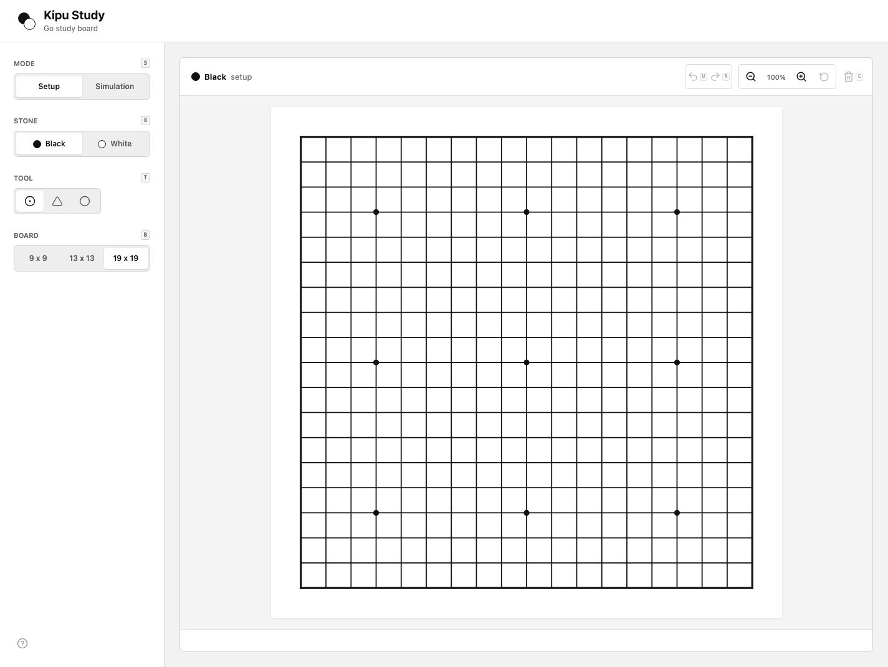
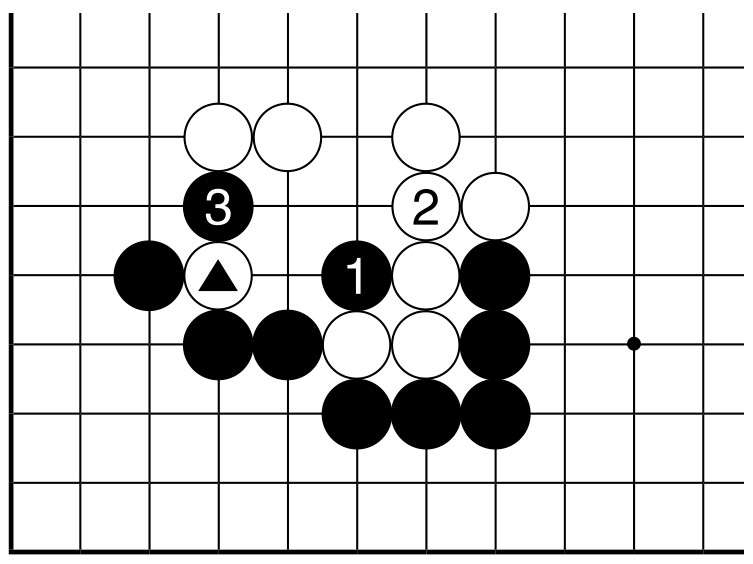

# Kipu Study

A minimalist, vector-first Go board for composing positions and studying
variations.

[Open Kipu Study](https://kipu-study.vercel.app/)

Kipu Study turns a printed game record or teaching shape into an interactive
board. Set up any position freely, then switch to simulation mode to play
numbered moves with captures and alternating turns.



## Why Kipu Study

Traditional Kipu diagrams are compact and expressive, but they are static.
Kipu Study keeps that quiet black-and-white visual language while making the
position editable, replayable, and easier to use while learning or teaching.

<p align="center">
  
</p>

<p align="center"><em>Reference Kipu supplied for this project.</em></p>

## Features

- **Setup mode** places black or white stones in any order without applying Go
  rules. Left-drag with the Stone tool to preview and place a straight
  horizontal or vertical wall on release. Starting on or crossing an occupied
  intersection cancels the drag. Select a stone and press Delete or Backspace
  to remove it.
- **Simulation mode** alternates turns from a chosen starting color, captures
  groups with no liberties, and rejects self-capture.
- **Automatic move numbers** preserve the played sequence directly on the
  stones.
- **Diagram marks** add triangles or circles with contrast-aware colors on
  black stones, white stones, or empty intersections.
- **Three board sizes** support 9x9, 13x13, and 19x19 study.
- **SVG rendering** keeps the board, stones, grid, and labels sharp at every
  zoom level.
- **Right-drag panning** moves a zoomed board when it is larger than the
  viewport.
- **Undo and redo** cover placement, marks, moves, captures, and board clearing.
  Clearing the board returns the application to Setup mode.
- **Responsive controls** keep the complete workflow available on desktop and
  mobile.
- **In-app shortcut help** is available from the question mark button in the
  bottom-left corner.

## Using The Board

### Compose A Position

1. Choose a 9x9, 13x13, or 19x19 board.
2. Stay in **Setup** mode.
3. Select Black or White, then click or left-drag to place stones. Dragging
   previews a horizontal or vertical wall and commits it on release; touching
   an occupied intersection cancels the drag.
4. Select the triangle or circle tool to annotate intersections.
5. With the Stone tool active, select a stone and press Delete or Backspace to
   remove it.

### Play A Variation

1. Build the starting shape in Setup mode.
2. Switch to **Simulation** mode.
3. Choose whether Black or White moves first.
4. Place moves normally. Kipu Study numbers each move, alternates colors, and
   removes captured groups.
5. Use undo and redo to compare branches or revisit a teaching point.

## Shortcuts

Open the question mark button in the bottom-left corner for the same reference
inside the application.

| Action | macOS | Windows / Linux |
| --- | --- | --- |
| Toggle Setup / Simulation | `M` | `M` |
| Toggle stone color / first move | `S` | `S` |
| Cycle Stone / Triangle / Circle tool | `T` | `T` |
| Cycle 9x9 / 13x13 / 19x19 board | `B` | `B` |
| Clear the board and return to Setup | `C` | `C` |
| Remove selected setup stone | `Delete` / `Backspace` | `Delete` / `Backspace` |
| Deselect the current stone | `Escape` | `Escape` |
| Undo | `Command + Z` | `Ctrl + Z` |
| Redo | `Command + Shift + Z` | `Ctrl + Shift + Z` |
| Pan an oversized board | Right-drag | Right-drag |

## Quick Start

Kipu Study currently requires Node.js 22 or newer.

```sh
npm install
npm run dev
```

Vite prints the local URL when the development server is ready.

Run the rules suite and create a production build with:

```sh
npm test
npm run build
```

## Deployment

The production application is available at
[kipu-study.vercel.app](https://kipu-study.vercel.app/).

The site is public: anyone with the URL can use it without a Vercel account or
an invitation. Sharing the application URL does not grant access to the Vercel
project or its settings.

Vercel uses the Vite preset, runs `npm run build`, and serves the generated
`dist/` directory. The application currently requires no deployment
environment variables.

## Current Rules Scope

Implemented:

- Alternating black and white turns
- Group liberty calculation
- Single-stone and multi-stone captures
- Self-capture prevention
- Capture counts

Not implemented yet:

- Ko and superko
- Pass moves and game completion
- Territory scoring
- SGF import or export
- Saved games and named variations

## Architecture

Kipu Study is a client-side React and TypeScript application built with Vite.

```text
src/
  App.tsx       UI state, history, controls, and SVG board
  App.css       Responsive monochrome interface
  go.ts         Pure board model and Go move rules
  go.test.ts    Focused capture and legality tests
docs/images/    README screenshots and visual reference
```

The Go rule engine is independent from React, which keeps it straightforward to
test and leaves room for SGF support, richer variation trees, or a future
Electron shell.

## Roadmap

- Import and export SGF records
- Add ko, pass moves, and scoring
- Save named positions and variation branches
- Package the web application as an Electron desktop app
